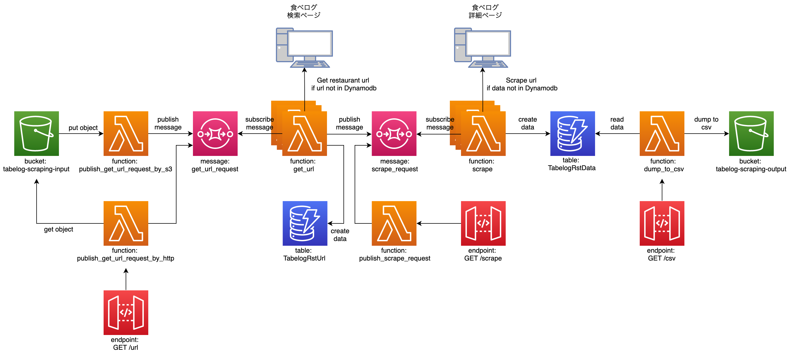

# 食べログスクレイピング

# Architecture


# Requirement
- python 3.x
- serverless framework (開発時のバージョンは以下)
```
$serverless --version
Framework Core: 2.47.0
Plugin: 5.4.0
SDK: 4.2.3
Components: 3.12.0
```

# Deployment
以下を参考にslsコマンドが使える状態にしておく。

https://www.serverless.com/framework/docs/providers/aws/guide/installation/

ルートディレクトリで以下コマンドを実行し、デプロイ。
```
sls deploy
```

リソースを`削除`する場合は以下。
```
sls remove
```
